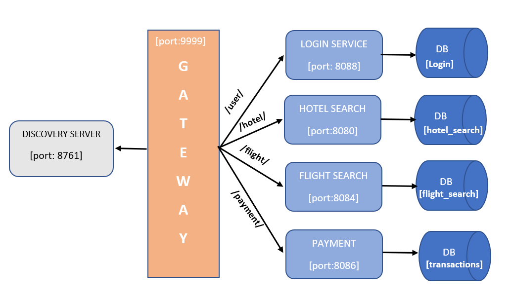

# **TRAVELO**

## **Problem Statement**

1. Design & Develop a Backend System for Travel to bridge the gap between service providers

2. Service Receivers (Consumers) can book Flight Tickets & Hotels. They can avail all these
   services via placing an booking through the Mobile App / Portal.

3. Create a Login for the application and after successful login, User can do the Flight
   Search & Hotel Search.

4. If the type is Flight, Search should have all input parameters as Departure Location,
   Arrival Location, Flight Class (Economy/Business)., Flight Date.

5. If the type is Hotel, Search should have all input parameters as Hotel Name, City,
   Check In Date, Check Out Date Output.

6. Once Search is triggered after specifying the search parameters, It will display the
   search results.

7. User can also shortlist the Hotels only.

8. Next Step, Consumer will create a Booking.

9. When a service is requested, Booking is generated at the backend system and then various
   background validation happens in the system with respect to availability & payment
   confirmation… so on and so forth. Based on validation status, booking status will be
   updated in the system.

10. Consumer will also get a notification with respect to the booking confirmation and service
    provider details & Service Provider will also get the Detailed Description for customer &
    Other details (ex- Address, Contact Number of Consumer).

11. In case of Validation Failure, Consumer will receive notification for Booking cancelled, At
    the same time, System must take care for refund process.

    >

### **1. Discovery Server:**

- Eureka is used as Discovery Server
- Running on default eureka prot 8761

### **2. API Gateway**

- For Gateway Spring cloud gateway is used
- Gateway service is running on port 9999
- In gateway resilience circuit breaker is used
- If any service is down circuit breaker redirect to fallback Api and return a message.

### **3. Login**

- Login service is use for authentication
- For login user need to sign up first
- Then generate token
- Then validate the token
- Authrization is not implemented

### **4. Flight Search:**

- Flight Search service is use for storing flight related data and booking flights
- Flight Search service can book and cancel one way and two way trip flight tickets
- Both types of booking and cancellation will perform using diffrent apis and both order stores in different tables
- Assume Data store in database about flights show current flight details
- Flight Search also contain Service Providers related apis
- Number of seat book will be equal in both journey
- Flight book will perform on certain parameter like departure date, departure location, flight name, arrival location, flight class, arrival date and number of seat want to book
- If database has flight according to user specification booking will be done after payment confirmation
- For notification: I have use log

### **5. Hotel Search:**

- Hotel Search service is use for storing hotel related data and booking hotel
- Hotel search service can book and cancel hotels
- We can wishlist hotels
- Assume Data store in database about hotels show current hotel details
- Hotel search will perform booking on certain parameters city, name, check in date, check out date and number of room want to book
- If database has flight according to user specification booking will be done after payment comfirmation
- For notification: I have use log

### **6. Payment:**

- Payment service is use for payment
- Payment status will tell about whether payment is successful or not
- Log is use for payment notification
- Hotel search and Flight Search communicate with payment service via Synchronous communication

## Technology Use

This application is develop using these technologies:

1. Microservices: Java Springboot (jdk and Maven mendatory)
2. Database: Mysql
3. Deployment: Docker
4. Distributed Tracing: Zipkin and Sleuth
5. Postman to test rest api

## Setup Guide

### 1. Using Docker:

1. For running this application using docker compose docker should be install in your system.
2. Install docker compose Plugin: sudo apt-get install docker-compose-plugin
3. Check Version: docker compose version
4. From github:
   - sudo git clone https://github.com/kritika-singh-sengar/travelo.git
   - cd travelo
   - docker compose up
5. Or Download zip and Go to project main folder and run: docker compose up

### 2. For Local Machine:

#### Database

1.  Download MySql database in local machine.
2.  Name of Databases use- login, hotel_search, flight_search, transactions
3.  For Creating Database:
    - Open MySql Work Bench
    - Run [local-setup.sql](../../../../../D:/My-Projects/MicroServices-Booking-System/Microservices_Java/NAGP/init/sql/local-setup.sql) in Mysql work bench.

#### Zipkin Sleuth

1.  Using docker : docker run -d -p 9411:9411 openzipkin/zipkin
2.  Using Java:(If you have Java 8 or higher installed)
    - curl -sSL https://zipkin.io/quickstart.sh | bash -s
    - java -jar zipkin.jar
3.  For more Info: https://zipkin.io/pages/quickstart.html

#### Starting Application

1. Start Zipkin Server
2. Start Discovery server Service first
3. Start other services
4. Use postman for runing Rest Apis
